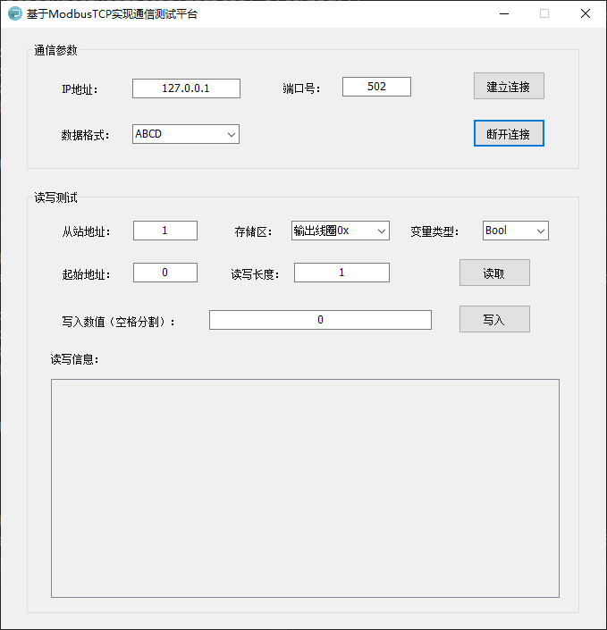
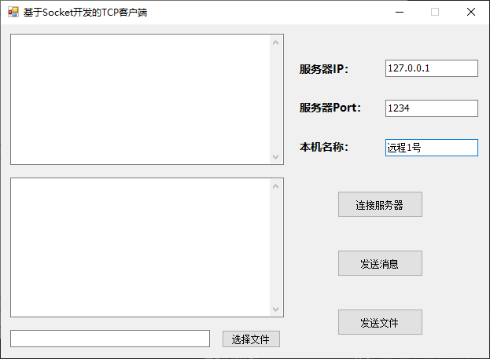
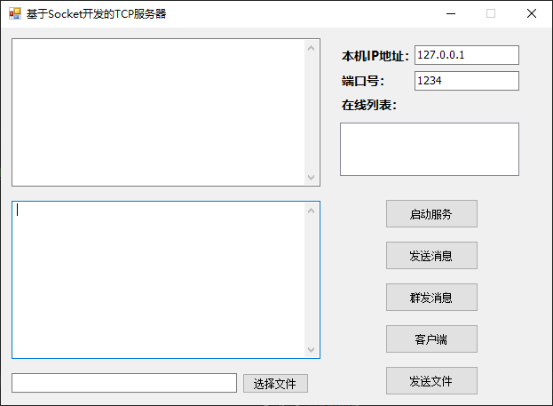

# WindowsToolDemo

一组 **Windows 桌面小工具**（C# / WinForms），用于现场快速配置设备网络、系统显示策略，以及串口 / Modbus / Socket 设备调试与通信。
目前包含六个独立工具：**IPSetter**（有线网卡 IP 设置）、**ScreenSaverTool**（壁纸 / 锁屏 / 屏保设置）、**SerialPortDemo**（串口调试助手）、**ModbusRTUDemo**（Modbus RTU 主站调试）、**ModbusTCPDemo**（Modbus TCP 主站调试）与 **SocketDemo**（TCP 通信演示）。

> 标签：`C#` `WinForms` `WMI` `组策略` `串口` `Modbus` `RS485` `Modbus TCP` `Socket` `TCP` `Windows` `上位机` `GitHub`

---

## 功能特性

- **IPSetter**：扫描本机有线网卡，一键设置静态 IP / 子网掩码 / 默认网关或切回 DHCP，自动过滤虚拟与无线适配器并记忆上次配置。
- **ScreenSaverTool**：通过本地组策略设置桌面壁纸与锁屏背景，并固化「不显示锁屏 / 禁用屏保 / 阻止自动锁屏」等系统策略。
- **SerialPortDemo**：基于 .NET SerialPort 的串口调试助手，支持 ASCII/HEX 双模式收发、定时发送、接收暂停与快捷命令管理。
- **ModbusRTUDemo**：基于 RS485 串口的 Modbus RTU 主站调试工具，封装常用功能码（01/02/03/04/05/06/0F/10）与 CRC16 校验，支持多存储区读写与多种数据类型字节序组包。
- **ModbusTCPDemo**：基于 TCP 套接字的 Modbus TCP 主站调试工具，以 MBAP 报文头封装常用功能码（01/02/03/04/05/06/0F/10）（无需 CRC，由 TCP 保证可靠传输），支持多存储区读写与多种数据类型字节序组包。
- **SocketDemo**：基于 .NET Socket 的 TCP 通信演示，包含客户端（连接 / 收发文本 / 收发文件）与服务端（监听多客户端、在线列表、单发 / 群发 / 文件传输）。

- [ ] 规划中：文件加密 / 解密工具
- [ ] 规划中：格式转换工具

---

## 技术栈

| 项目                  | 说明                                                                                                                                                     |
| ------------------- | ------------------------------------------------------------------------------------------------------------------------------------------------------ |
| 语言                  | C#（.NET Framework）                                                                                                                                      |
| UI                  | Windows Forms（界面全部代码生成，无设计器）                                                                                                                            |
| IPSetter 框架         | .NET Framework **4.7.2**                                                                                                                                |
| ScreenSaverTool 框架  | .NET Framework **4.8**                                                                                                                                  |
| SerialPortDemo 框架   | .NET Framework **4.6**                                                                                                                                  |
| ModbusRTUDemo 框架    | .NET Framework **4.7.2**                                                                                                                                  |
| ModbusTCPDemo 框架    | .NET Framework **4.7.2**                                                                                                                                  |
| SocketDemo 框架       | .NET Framework **4.7.2**                                                                                                                                  |
| 关键技术                | WMI（`Win32_NetworkAdapter`）、注册表 + 本地组策略 PReg 二进制读写、Win32 API（`SystemParametersInfo`、`Wow64DisableWow64FsRedirection`）、`powercfg`、`.NET SerialPort`、`Modbus RTU / RS485（CRC16）`、`.NET Socket / Modbus TCP（MBAP）`、`.NET Socket / TCP` |
| 构建                  | Visual Studio 2022（含「.NET 桌面开发」工作负载）                                                                                                                |

---

## 环境要求

- Windows 10 / 11
- 运行时：建议安装 **.NET Framework 4.8**（向下兼容 4.6 及以上）
- Visual Studio 2022（打开 `WindowsToolDemo.sln` 编译）
- **管理员权限**：`ScreenSaverTool` 需写计算机配置 / 电源策略（已通过 `app.manifest` 请求提权），请以管理员身份运行
- **SerialPortDemo / ModbusRTUDemo / ModbusTCPDemo 依赖**：`xbd.DataConvertLib` 为 NuGet 包，首次生成时自动还原（`SocketDemo` 为纯 .NET Framework，无第三方依赖）
- **ModbusTCPDemo 项目引用**：直接引用 `ModbusRTUDemo` 工程，复用其 `Helper`（字节数组 / 互斥锁 / 存储区枚举等），生成时请确保 `ModbusRTUDemo` 一并编译

---

## 快速开始

```bash
# 1. 克隆仓库（Gitee / GitHub 任选其一）
#    Gitee:
git clone https://gitee.com/zyuanlbj/WindowsToolDemo.git
#    GitHub:
git clone https://github.com/zyuanlbj/WindowsToolDemo.git

# 2. 用 VS2022 打开解决方案
WindowsToolDemo.sln

# 3. 生成解决方案（VS 打开一般自动还原 NuGet 包）
#    生成 -> 生成解决方案（或 F6）

# 4. 运行
#    右键对应项目 -> 设为启动项目 -> F5
#    ScreenSaverTool 请「以管理员身份运行」，否则计算机配置类策略不生效
```

---

## 目录结构

```
WindowsToolDemo/
├─ WindowsToolDemo.sln        # 解决方案（含六个子项目）
├─ IPSetter/                  # 有线网卡 IP 设置工具
│  ├─ IPSetter.csproj
│  ├─ MainForm.cs             # 界面与交互
│  ├─ NetworkConfigurator.cs  # WMI 读写网卡配置（含虚拟适配器过滤）
│  ├─ Program.cs
│  ├─ app.manifest            # 提权清单
│  └─ ip.ico
├─ ScreenSaverTool/          # 壁纸 / 锁屏 / 屏保设置工具
│  ├─ ScreenSaverTool.csproj
│  ├─ MainForm.cs             # 界面与策略联动
│  ├─ GroupPolicyHelper.cs    # 本地组策略 Registry.pol 二进制读写（PReg 格式）
│  ├─ IGroupPolicyObject2.cs  # 组策略 COM 接口封装
│  ├─ Native.cs               # Win32 API 封装（壁纸 / 屏保 / Wow64 重定向）
│  ├─ Program.cs
│  ├─ app.manifest            # 提权清单
│  └─ screensaver.ico
├─ SerialPortDemo/           # 串口调试助手
│  ├─ SerialPortDemo.csproj
│  ├─ FrmMain.cs              # 主窗体：串口参数配置、收发、定时发送
│  ├─ FrmMain.Designer.cs
│  ├─ FrmQuickSet.cs          # 快捷命令（命名 + HEX 内容校验）
│  ├─ ParityHelper.cs         # 校验辅助
│  ├─ Helper\HexHelper.cs     # HEX ⇄ ASCII 转换、字节拼接等
│  ├─ Program.cs
│  ├─ App.config
│  └─ USB.ico
├─ ModbusRTUDemo/            # Modbus RTU 主站调试（RS485 串口）
│  ├─ ModbusRTUDemo.csproj
│  ├─ FrmMain.cs             # 主窗体：从站地址、串口参数、读写操作、日志
│  ├─ FrmMain.Designer.cs
│  ├─ Helper\ModbusRtu.cs    # Modbus RTU 协议（功能码 01/02/03/04/05/06/0F/10 + CRC16）
│  ├─ Helper\SimpleHybirdLock.cs # 串口读写互斥锁
│  ├─ Program.cs
│  ├─ App.config
│  └─ system.ico
├─ ModbusTCPDemo/            # Modbus TCP 主站调试（TCP 套接字）
│  ├─ ModbusTCPDemo.csproj   # 引用 ModbusRTUDemo 工程（复用 Helper）
│  ├─ FrmMain.cs             # 主窗体：IP / 端口 / 从站地址、读写操作、日志
│  ├─ FrmMain.Designer.cs
│  ├─ Helper\ModbusTcp.cs    # Modbus TCP 协议（MBAP 报文头 + 功能码 01/02/03/04/05/06/0F/10）
│  ├─ Program.cs
│  ├─ App.config
│  └─ system.ico
└─ SocketDemo/               # TCP 通信演示（客户端 / 服务端）
   ├─ SocketDemo.csproj
   ├─ FrmTcpClient.cs        # TCP 客户端：连接、收发文本、收发文件
   ├─ FrmTcpClient.Designer.cs
   ├─ FrmTcpServer.cs        # TCP 服务端：监听多客户端、在线列表、单发 / 群发 / 文件
   ├─ FrmTcpServer.Designer.cs
   ├─ Program.cs
   └─ App.config
```

---

## 界面预览

### IPSetter（有线网卡 IP 设置）


### ScreenSaverTool（屏保与背景设置）


### SerialPortDemo（串口调试助手）


### ModbusRTUDemo（Modbus RTU 主站调试）


### ModbusTCPDemo（Modbus TCP 主站调试）



### SocketDemo（TCP 客户端）



### SocketDemo（TCP 服务端）



---

## 使用说明

### IPSetter（设置有线网卡 IP）

1. 启动后程序自动列出本机**有线网络适配器**。
2. 在「IP 地址 / 子网掩码 / 默认网关」填入目标值（默认已带常用占位值）。
3. 点 **应用静态 IP** 写入；点 **启用 DHCP** 切回自动获取。
4. 点 **刷新** 重新枚举适配器并刷新当前配置。

> 程序会过滤 Hyper-V / VMware / VPN / Wi-Fi 等虚拟与无线网卡，避免误改。

### ScreenSaverTool（壁纸 / 锁屏 / 屏保）

1. 程序**启动即应用一套预设**：保护策略启用、不显示锁屏、屏保设为「无」、阻止自动锁屏，并后台执行 `gpupdate /force`。
2. 点 **选择图片** 选取壁纸，再点 **设置背景** 应用到桌面壁纸 + 锁屏背景。
3. 三个策略开关可手动切换，状态实时反映到 `gpedit.msc`：
   - **功能保护**：禁用「外观 / 壁纸 / 屏保」设置页
   - **不显示锁屏**：计算机配置 → 个性化 → 不显示锁屏
   - **启用屏幕保护程序**：用户配置 → 个性化 → 设为「已禁用」
4. 所有策略同时写入本地组策略 `.pol` 文件（供 `gpedit.msc` 显示）与实时注册表（立即生效）。

> ⚠️ 该程序会修改**系统级组策略与电源策略**，建议在测试机 / 展示机上使用；生产环境慎用。
> 要用 `gpedit.msc` 验证效果，必须以管理员身份运行本程序，否则计算机配置段无法落盘。

### SerialPortDemo（串口调试助手）

1. 选择**串口号**，并设置**波特率 / 校验位 / 数据位 / 停止位 / RTS**（默认常用参数）。
2. 点 **打开串口** 建立连接；再次点 **关闭串口** 断开。
3. **发送**：在发送区输入文本或 HEX（勾选 HEX 模式），点发送；可开启**定时发送**循环下发。
4. **接收**：接收区实时显示，支持 ASCII / HEX 显示切换；可**暂停接收**与**清空**。
5. **快捷命令**：通过「快捷命令」管理常用指令（名称 + HEX 内容，自动校验格式），一键发送。
6. 底部状态栏显示发送 / 接收字节计数与连接状态。

> 依赖：`xbd.DataConvertLib`（NuGet 包，首次生成时自动还原）。

### ModbusRTUDemo（Modbus RTU 主站调试）

1. 选择**串口号**与**波特率 / 校验位 / 数据位 / 停止位**（默认 9600），填写**从站地址（Slave）**，点 **连接** 建立 RS485 串口链路。
2. 选择**存储区**：输出线圈 `0x`、输入状态 `1x`、保持寄存器 `4x`、输入寄存器 `3x`，并填写起始地址与长度。
3. 点 **读取** 下发对应功能码（01/02/03/04）并解析返回报文，结果在日志区显示。
4. 点 **写入** 执行单点 / 多点写操作（05/06/0F/10）；可写入 `short / ushort / int / uint / float` 及数组，按 **DataFormat** 字节序（ABCD 等）组包。
5. 底部日志区实时显示连接状态与收发报文，便于排查通信异常。

> 基于 RS485 半双工总线，调试时请确保接线（A/B）与终端电阻正确；更多协议基础见 `docs/md/01 Modbus基础.md`、`docs/md/02 ModbusRTU.md`。

### ModbusTCPDemo（Modbus TCP 主站调试）

1. 填写**服务器 IP** 与**端口**（Modbus TCP 默认 `502`），并填写**从站地址（Slave）**，点 **连接** 通过 TCP 与从站建立链路（无串口参数，无需 CRC）。
2. 选择**存储区**：输出线圈 `0x`、输入状态 `1x`、保持寄存器 `4x`、输入寄存器 `3x`，并填写起始地址与长度；可切换 **DataFormat** 字节序（ABCD 等）。
3. 点 **读取** 下发对应功能码（01/02/03/04），由 `ModbusTcp` 自动封装 MBAP 报文头并解析返回；点 **写入** 执行单点 / 多点写（05/06/0F/10）。
4. 底部日志区实时显示连接状态与收发报文，便于排查通信异常。

> 与 RTU 版复用同一套 `ModbusRTUDemo.Helper`（字节数组、互斥锁、存储区 / 数据类型枚举）；区别仅在传输层：TCP 用 MBAP 报文头、依赖 TCP 的可靠性保证，**不再做 CRC16 校验**。更多协议基础见 `docs/md/01 Modbus基础.md`、`docs/md/02 ModbusRTU.md`、`docs/md/04 ModbusTCP.md`。

### SocketDemo（TCP 通信演示）

**服务端（FrmTcpServer）**

1. 填写**IP**（本机监听地址）与**端口**，点 **开启服务** 完成 `Bind` + `Listen`，开始监听客户端连接。
2. 客户端连入后，左侧**在线列表**自动增删，连接 / 断开均有日志提示。
3. 在发送框输入文本，选中在线列表中的某客户端点 **发送** 单发，或点 **群发** 广播给所有客户端。
4. 点 **选择文件** 选定文件后，选中目标客户端点 **发送文件** 传输；对端自动弹出保存对话框（首字节标志 0=文本 / 1=文件，UTF-8 编码）。
5. 可点 **打开客户端** 直接从服务端拉起一个 TCP 客户端窗体，便于本机自测。

**客户端（FrmTcpClient）**

1. 填写**服务器 IP** 与**端口**，点 **连接** 与服务端建立 TCP 连接（后台接收线程持续收消息）。
2. 在发送框输入文本（可带**昵称**前缀）点 **发送**；接收区实时显示收发内容。
3. 点 **选择文件** → **发送文件**，将本地文件发给服务端；收到文件时自动弹出保存对话框。

> 该 Demo 用于学习 `System.Net.Sockets.Socket` 的同步 TCP 收发、多客户端字典管理与会话文件传输，未做心跳 / 重连等生产加固；Socket 网络基础见 `docs/md/03 Socket.md`。

---

## 技术亮点（作品集向）

- **本地组策略 PReg 二进制读写**：直接解析 / 生成 `Registry.pol`（`PReg` 头 + UTF-16LE 字段），让 `gpedit.msc` 正确显示策略状态，不依赖 `gpedit` UI。
- **SysWOW64 重定向处理**：32 位进程访问 `System32` 会被重定向到 `SysWOW64`，导致 `.pol` 写错位置、`gpedit` 看不到。已用 `Wow64DisableWow64FsRedirection` 关闭重定向，确保写进真正的 `System32\GroupPolicy\`。
- **防自动锁屏防护链**：屏保设为「无」 + 不显示锁屏 + 禁用「计算机不活动限制」+ 禁用「唤醒时需要密码（CONSOLELOCK）」+ `powercfg` 立即生效，多层兜底。
- **串口调试助手**：基于 `.NET SerialPort` 实现 ASCII / HEX 双模式收发、定时发送、接收暂停与字节计数；`HexHelper` 提供 HEX ⇄ ASCII 互转与字节拼接，`ParityHelper` 提供校验辅助。
- **Modbus RTU 协议栈**：自实现 8 个常用功能码（读 / 写线圈与寄存器）的报文拼接与解析、表驱动 CRC16 校验，并用互斥锁保证半双工总线单次交互原子性；`xbd.DataConvertLib` 负责多数据类型按字节序组包 / 拆包。
- **Modbus TCP 协议栈**：基于 `.NET Socket` 实现 Modbus TCP 主站，复用 RTU 版的 Helper 与数据类型枚举，以 **MBAP 报文头**（事务标识 + 协议标识 + 长度 + 单元标识）封装 8 个常用功能码，依赖 TCP 可靠性故**不做 CRC16**；与 RTU 版共享存储区 / DataFormat 字节序逻辑，体现「同一协议、两套传输」的工程复用。
- **TCP 通信演示**：基于 `.NET Socket` 实现服务端 `Accept` 多客户端（`Dictionary<RemoteEndPoint, Socket>` 管理会话）+ 客户端连接；首字节标志位区分文本 / 文件两类报文，演示同步收发、在线列表与单发 / 群发 / 文件传输。

---

## 贡献

欢迎提 Issue 和 Pull Request。

1. 在 Gitee 或 GitHub 上 Fork 本仓库
2. 新建分支：`git switch -c feature/你的功能`
3. 提交：`git commit -m "feat: 新增 xxx"`
4. 推送并提 PR

> 提交信息推荐用 Conventional Commits：`feat` / `fix` / `docs` / `refactor`

---

## 许可证

[MIT](LICENSE)

---

## 联系方式

- 作者：zyuanlbj
- 邮箱：793194012@qq.com
- 备注：工业上位机 / PLC 通信相关交流欢迎联系
